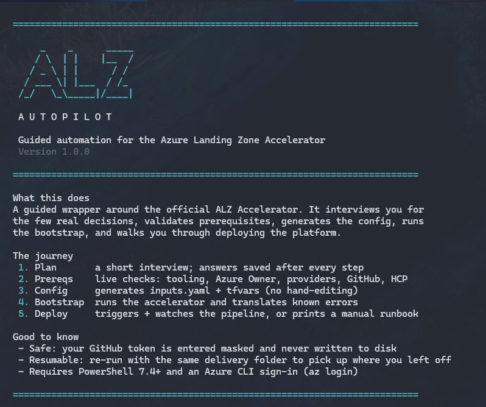

<!-- markdownlint-disable -->
<p align="center">
  
</p>

# ALZ Autopilot: How to Use

Guided automation for the official [Azure Landing Zones IaC Accelerator](https://azure.github.io/Azure-Landing-Zones/accelerator/). One entry point that interviews you for the real decisions, checks every prerequisite before it can bite you, generates the config, runs the bootstrap, and watches the deployment pipeline to completion.

It does not replace the accelerator. It calls the same `Deploy-Accelerator` cmdlet with the same config files and produces the same repos, identities, state, and landing zone. You can stop using it at any point and continue from the official docs.

---

## Before you start

**Tooling**

| Requirement | Notes |
|---|---|
| PowerShell **7.4+** | Windows PowerShell 5.1 is refused. Run from `pwsh`, not Cloud Shell |
| Azure CLI | Signed in with `az login` |
| Git | Required by the accelerator |

The ALZ PowerShell module is installed for you if it is missing.

## Repo visibility and self-hosted runners

On a **free** GitHub org the accelerator's repos are created **public**, because environments (which the approval gate and the Azure OIDC config depend on) only work on public repos under GitHub Free.

If you also enable **self-hosted runners** for private networking, be aware of the combination: the runners execute inside your VNet, with private-endpoint access to the Terraform state, on a repository anyone can fork. GitHub's guidance:

> We recommend that you only use self-hosted runners with private repositories. This is because forks of your public repository can potentially run dangerous code on your self-hosted runner machine by creating a pull request that executes the code in a workflow.

Preflight warns when it sees both. Mitigations, in order of strength:

1. Paid org with private repos, which removes the exposure.
2. Do not use self-hosted runners, so a hostile fork PR at worst runs on GitHub-hosted ephemeral VMs.
3. Settings > Actions > **"Require approval for all external contributors"**. Note the default, *first-time contributors*, stops applying to anyone who has ever had a PR merged.

### Converting to private repos later

1. **Upgrade the org to Team first.** Private repos are free; environments on private repos are not. Convert while still on Free and protection rules are silently ignored, which strips the `environment:` claim from the OIDC token and breaks Azure authentication with `AADSTS700213`.
2. Convert the **module** repo to private. A private caller can still call a public reusable workflow, so nothing breaks yet.
3. Convert the **templates** repo to private.
4. Immediately set templates repo > Settings > Actions > **General** > *Access* > "Accessible from repositories in the organization". Without it the caller cannot resolve the reusable workflow.
5. Run `02 Continuous Delivery` and confirm it plans, gates, and applies.

Leaving the templates repo public is a valid shortcut: a private caller calling a public reusable workflow needs no access policy.

## Using HCP Terraform for state

The accelerator has **no** HCP option: it always bootstraps an Azure Storage backend. Moving to HCP is therefore a post-bootstrap migration across both repos, and it is the step most likely to go wrong.

Select HCP during the interview and the app will:

1. Validate in preflight that the workspace exists and is in **Local** execution mode. Remote mode breaks the plan/apply handoff.
2. Print the migration steps after bootstrap.
3. **Verify** the migration before letting the pipeline run, with eight checks against the live repos:

| Check | Why |
|---|---|
| `cloud` block present in the module repo | This is what points Terraform at HCP |
| No `backend "azurerm"` left behind | A cloud block and an azurerm backend cannot coexist |
| `TF_TOKEN_app_terraform_io` secret exists | Metadata only; the value is never readable |
| No `-backend-config` in `cd-template.yaml` | Conflicts with the cloud block |
| No `-backend-config` in `ci-template.yaml` | Same, but leave the validate step's `-backend=false` alone |
| Secret declared and used in each template | The wiring people forget |
| `secrets: inherit` on each caller workflow | Without it the token never reaches the reusable workflow |

If anything is outstanding the app blocks, lists exactly what is missing with the fix, and marks the phase failed. Fix and re-run.

Finish with `terraform init -migrate-state` to move existing state into HCP.

**Azure**

- **Owner** on the parent management group (usually Tenant Root Group).
- **Owner** on each platform subscription.
- **Management** and **Connectivity** subscriptions are required. **Identity** and **Security** are recommended but can be added later, which is the documented SMB pattern. Each subscription can fill only one role.

**GitHub**

A GitHub **organization** (personal accounts are not supported). On a free org the accelerator makes the repos public, which is fine for a rehearsal and not for production.

Create a fine-grained PAT (`token-1`) with Resource owner set to your org and Repository access set to all repositories:

- **Repository**: Actions, Administration, Contents, Environments, Secrets, Variables, **Workflows** (all Read and write)
- **Organization**: **Members** (Read and write), plus **Self-hosted runners** (Read and write) if you use self-hosted runners

If you choose private networking with self-hosted runners, create a second PAT (`token-2`, "Runner Registration"):

- **Repository**: Administration (Read and write)
- **Organization**: Self-hosted runners (Read and write)

Both tokens are typed masked at the prompt and are never written to disk.

**Pick a delivery folder that is NOT cloud-synced.** OneDrive, Dropbox, and similar break the accelerator: Terraform's `fileset()` returns inconsistent results on synced paths, which silently produces repos with no workflows. Use something like `C:\Users\<you>\Documents\ALZ`. The app itself can live on OneDrive; only the delivery folder matters.

---

## Running it

```powershell
cd "<path>\ALZAutoPilot"
.\Start-ALZDelivery.ps1 -DeliveryPath "C:\Users\<you>\Documents\ALZ"
```

| Parameter | Purpose |
|---|---|
| `-DeliveryPath` | Folder holding this delivery's config, output, and saved state. Prompted if omitted |
| `-Reset` | Start over, ignoring saved answers |
| `-SkipPreflight` | Jump straight to config and bootstrap. Not recommended |
| `-NoClear` | Keep existing console output instead of clearing the screen on start |

Answers are saved after every step, so you can stop at any point and re-run to resume.

---

## What happens, phase by phase

### 1. Plan (interview)

Asks only the decisions that change the output: delivery name, region, GitHub org, platform subscriptions, parent management group, apply approvers, Defender contact email, state backend, **IaC language**, target topology, and whether to use private networking with self-hosted runners.

Every answer is validated as you type (GUIDs, region names, GitHub usernames, email format), and duplicate subscriptions are rejected on the spot.

**Terraform** offers all 11 accelerator scenarios, each showing the accelerator's own scenario number so you can cross-reference the docs. Choosing a multi-region scenario prompts for a second region.

**Bicep** offers the three supported network types (`none`, `hubNetworking`, `vwanConnectivity`) and always collects two regions, because the official Bicep config ships with two. Bicep additionally requires **User Access Administrator at the root (`/`) scope**, which the app calls out during the interview.

### 2. Prerequisites

Each check runs live and prints a remediation panel with the exact fix if it fails:

- Local tooling and the ALZ module
- Azure sign-in and subscription context
- Owner rights on the platform subscriptions
- Resource providers, with an offer to register them across all subscriptions
- Existing management groups, subscription placement, and whether the platform subscriptions already contain resources (see [Brownfield tenants](#brownfield-tenants))
- GitHub PAT, org access, plan type, and a proactive probe of the Members permission
- HCP workspace and execution mode, when HCP is selected

If anything blocks, fix it and choose to re-run the checks without restarting the app.

### 3. Generate config

Writes `config/inputs.yaml` and the platform configuration for your chosen topology:

- **Terraform**: `config/platform-landing-zone.tfvars`, generated from the **official** example for that scenario, with regions, Defender contact, and subscription placement filled in.
- **Bicep**: `config/platform-landing-zone.yaml`, with regions and `network_type` filled in.

No hand-editing, and no chance of the classic mistake of replacing a `${starter_location_01}` template token instead of setting `starter_locations`.

The file is then yours to edit. On a re-run the app patches only the values the interview owns, so your edits survive. If you change scenario, it detects the mismatch and asks before replacing.

The config is also checked with `terraform fmt`. The accelerator's CI workflow runs `terraform fmt -check` and fails the build on unformatted files, which would block every future pull request, so anything off is corrected here. Formatting is whitespace-only, so it cannot change behaviour.

**Custom library**: if a `config/lib` folder exists (custom management groups, archetypes, policy definitions or assignments), it is detected and passed to the accelerator automatically. See [samples/lib-pci](samples/lib-pci/README.md) for a worked PCI DSS and HIPAA example.

### 4. Bootstrap

Runs the real `Deploy-Accelerator`. This creates the two repositories, the OIDC identities, and the Terraform state. It does **not** deploy your landing zone.

Around that call the app adds: secrets passed only as environment variables and scrubbed from the transcript, resource provider auto-registration disabled so it cannot hang, known errors translated into plain-language fixes, a self-heal for partial module downloads, and a post-run check that the repos actually received their CI/CD workflows.

### 5. Deploy the platform

The management group hierarchy, ALZ policy assignments, and management resources all deploy from the **"02 Continuous Delivery"** workflow, which runs `terraform apply` using OIDC to Azure.

Two options:

1. **Guided in the CLI**: discovers the repo, triggers the workflow, watches the run with a heartbeat, waits through the approval gate, and verifies the result.
2. **Manual**: prints a step-by-step runbook so you can drive the GitHub UI yourself. Useful when a customer should watch the plan, gate, and apply happen.

### 6. Summary and report

The console prints a short summary: delivery, topology, module repo, management group and policy counts, phases complete, and session time.

The detail goes to `<delivery>\reports\alz-delivery-<timestamp>.html`, and you are offered the chance to open it. It covers target state, subscriptions, what deployed, the last pipeline result, per-phase timings, and a **policy baseline** section explaining what the policy set is, how much of it is enforced versus audit-only, and the exact assignment names you would need to change any of it.

One self-contained file, no external references, no credentials. It prints for a closeout deck.

If you stop after the bootstrap, the policy section will say nothing is assigned yet, because policy deploys from the pipeline. Re-run after the pipeline completes to get the full inventory.

---

## The approval gate
The apply job waits for a human. Approving from the CLI usually fails, because a fine-grained PAT cannot review deployments and you must be a required reviewer. That is expected: approve in the browser, and the app keeps watching and reports the result. It polls for up to 60 minutes with a heartbeat so a long apply does not look frozen.

If you close the window, re-run the app and choose stage 2 option 1 to reattach to the run in progress.

**This tool cannot bypass that gate.** It is a GitHub deployment environment enforced server-side. The tool only submits an approval if you explicitly opt in at a prompt that defaults to No, and that call fails unless you are a named reviewer.

---

## Where it stops and asks

One entry point does not mean unattended deployment. The run halts at each of these:

| Gate | What you are confirming |
|---|---|
| Confirm target state | Tenant, subscriptions by name, topology, regions, runners, estimated cost |
| Review configuration | The generated platform config, before the bootstrap pushes it into the repo. **Stops unless you confirm** |
| Run the bootstrap | Before any Azure resource or repository is created |
| Trigger the pipeline | Starts `terraform plan`; the apply is still gated |
| Apply approval | Enforced by GitHub, not by this tool |

The accelerator requires a human to review the platform configuration before deploying. The tool fills in the values normally hand-edited, so placeholder mistakes cannot happen, and still stops for your review before bootstrapping.

---

## Stopping, resuming, and re-running

State lives in `.alz-delivery-state.json` in the delivery folder. It holds answers, phase status, and counters. It never holds secrets.

Re-running is safe. Completed phases are skipped and prompts default to the non-destructive answer:

| Prompt | Safe answer |
|---|---|
| Resume this delivery? | **Y** |
| Re-run preflight checks? | Either. The checks are read-only |
| Re-run the bootstrap anyway? | **N** unless you intend to. It recreates repo content and rewrites the federated credentials |
| Trigger the workflow now? | Either. Terraform is idempotent, so a re-run with no config change is effectively a no-op that still needs approval |

To start completely fresh, run with `-Reset`, or delete the state file.

---

## Troubleshooting

The app matches failures against a catalog of known signatures and prints the fix. The ones worth knowing up front:

| Symptom | Cause |
|---|---|
| Repos created but empty, no workflows | PAT missing **Workflows** permission. GitHub rejects the whole push atomically |
| `fileset(): function returned an inconsistent result` | Delivery folder is on a cloud-synced path |
| `The config file does not exist at ...ALZ-Powershell.config.json` | Version marker present but module folder missing. Self-heals on the next run |
| `Resource not accessible by personal access token` | PAT missing Organization **Members** |
| `listing blobs: 403 AuthorizationFailure` | Tenant policy disabled public access on the state storage, so hosted runners cannot reach it. Use private networking with self-hosted runners |
| `AADSTS700213: No matching federated identity record` | A GitHub Enterprise that customizes the OIDC subject. Update the credential subjects to match what the run log shows was presented |
| `SubscriptionNotRegisteredForFeature` on a public IP | Register `Microsoft.Network/AllowBringYourOwnPublicIpAddress`, then re-run |
| `409 Changes must be made through a pull request` | Re-bootstrapping with changed config against repos that already have branch protection. Prefer a fresh bootstrap with the final config |
| `All subscription ids must be valid UUIDs` | A blank or repeated subscription. Note `subscription_placement` appears in **two** files: `terraform.tfvars.json` and `platform-landing-zone.auto.tfvars`. Both must agree |
| Plan log full of `PolicyRoleAssignmentError ... id cannot be empty` | A known alzlib limitation surfaced as a **warning**, not the failure. Look above it for the real `Error:` line |
| `01 Continuous Integration` fails with exit code 3 on a pull request | `terraform fmt -check` found an unformatted file, usually after hand-editing the config in the web UI. Run `terraform fmt` on the module repo and commit. Until it is fixed, every pull request fails |

## What is not supported

| | |
|---|---|
| Local file system VCS | The app targets GitHub and Azure DevOps. Use the official accelerator directly for local |
| Azure DevOps stage 2 | Config generation and bootstrap are automated. Triggering and watching the pipeline is GitHub-only today, so Azure DevOps prints the runbook instead |
| `bicep-classic` | The accelerator accepts it; this app offers Terraform and Bicep only |
| Automatic editing of your repos | The HCP migration is verified, not applied. Editing a customer's IaC blind is riskier than checking it |
| Brownfield tenants | Existing estates are detected and flagged, but an existing hierarchy is not adopted. See the caution below |

## Brownfield tenants

The accelerator deploys into an existing tenant perfectly well. What it doesn't give you is a documented transition sequence, and neither does this app's interview. Everything below is reachable, it just isn't prompted for.

### What preflight tells you

- **Existing management groups**: any of the ALZ names already present. A full set is read as a re-run, a partial set as a collision.
- **Subscription placement**: a platform subscription already parented under an unrelated management group, since placement will move it and change which policies apply.
- **Subscription contents**: a platform subscription that already holds resource groups.

All three warn and never block, because deploying into a populated tenant is legitimate.

### What the policy baseline actually does to existing resources

Worth being precise, because this is usually overstated:

- **Deny** blocks create and update operations. It does not touch resources that already exist.
- **DeployIfNotExists** marks existing resources non-compliant but will not modify them until someone triggers a [remediation task](https://learn.microsoft.com/azure/governance/policy/how-to/remediate-resources). It applies automatically only on create or update.

So the baseline does not retroactively rewrite a running estate. The impact is on what gets deployed afterwards, plus compliance findings. That is still a change-control conversation, but it is not the emergency it is sometimes described as.

### Doing a controlled brownfield rollout

The platform config is yours after generation. The app patches only regions, security contact, and subscription placement on a re-run, so anything else you add survives. Use the **review gate** (the stop after config generation, before bootstrap) to make these edits.

**1. Adopt an existing hierarchy** rather than colliding with it:

```hcl
management_group_settings = {
  management_group_hierarchy_settings = {
    default_management_group_name = "alz"
    update_existing               = true
  }
  ...
}
```

**2. Land the baseline in audit-only** so nothing enforces on day one:

```hcl
policy_assignments_to_modify = {
  alz = {
    policy_assignments = {
      Deny-Classic-Resources = { enforcement_mode = "DoNotEnforce" }
    }
  }
}
```

There is no global switch for this. `enforcement_mode` is per assignment, so list the ones you care about. Get the exact names from your own tenant, since they are version-stamped:

```powershell
az policy assignment list --scope "/providers/Microsoft.Management/managementGroups/alz" -o table
```

**3. Stand up the hierarchy without moving any subscriptions.** Delete the whole `subscription_placement` block at the review gate. The app will not put it back: `Set-ALZTfvarsSubscriptionPlacement` looks for the block and exits if it is gone. The interview still requires management and connectivity subscription IDs, so supply real ones you own, then remove the placement.

That gives you the sequence Microsoft recommends: structure and policy first, assess compliance, then move subscriptions in deliberately once they are ready. See [Transition an environment by duplicating a landing zone management group](https://learn.microsoft.com/azure/cloud-adoption-framework/ready/landing-zone/align-approach-duplicate-brownfield-audit-only).

**4. Move subscriptions in later** by re-adding placement for one subscription at a time and letting the pipeline apply it, reviewing the plan each time.

### Before you point this at production

- Rehearse the whole thing in a clean tenant.
- Confirm you have Owner on the parent management group. In an established tenant that often needs [elevated access](https://learn.microsoft.com/azure/role-based-access-control/elevate-access-global-admin) at the root and is not granted by default.
- Check whether the Defender plans in the scenario config matter to you. The scenario sets twelve of them to `DeployIfNotExists`, which costs nothing on empty subscriptions and becomes real money once workload subscriptions join the hierarchy.

Full run transcripts are written to `%TEMP%\alz-bootstrap-<timestamp>.log` with tokens redacted.

---

## Security notes

- Tokens are read masked, passed only as `TF_VAR_*` environment variables for the run, cleared afterward, and scrubbed from the transcript.
- The state file never stores secrets.
- Values are validated and sanitized before they are written into YAML.
- The app is advisory over the accelerator: it does not deploy anything itself. Every Azure change is made by the accelerator or the pipeline.

---

## Reference

- Accelerator overview: https://azure.github.io/Azure-Landing-Zones/accelerator/
- Prerequisites: https://azure.github.io/Azure-Landing-Zones/accelerator/1_prerequisites/
- GitHub prerequisites and PAT scopes: https://azure.github.io/Azure-Landing-Zones/accelerator/1_prerequisites/github/
- Platform subscriptions: https://azure.github.io/Azure-Landing-Zones/accelerator/1_prerequisites/platform-subscriptions/
- Bootstrap: https://azure.github.io/Azure-Landing-Zones/accelerator/2_bootstrap/
- Run: https://azure.github.io/Azure-Landing-Zones/accelerator/3_run/
- Troubleshooting: https://azure.github.io/Azure-Landing-Zones/accelerator/troubleshooting/
