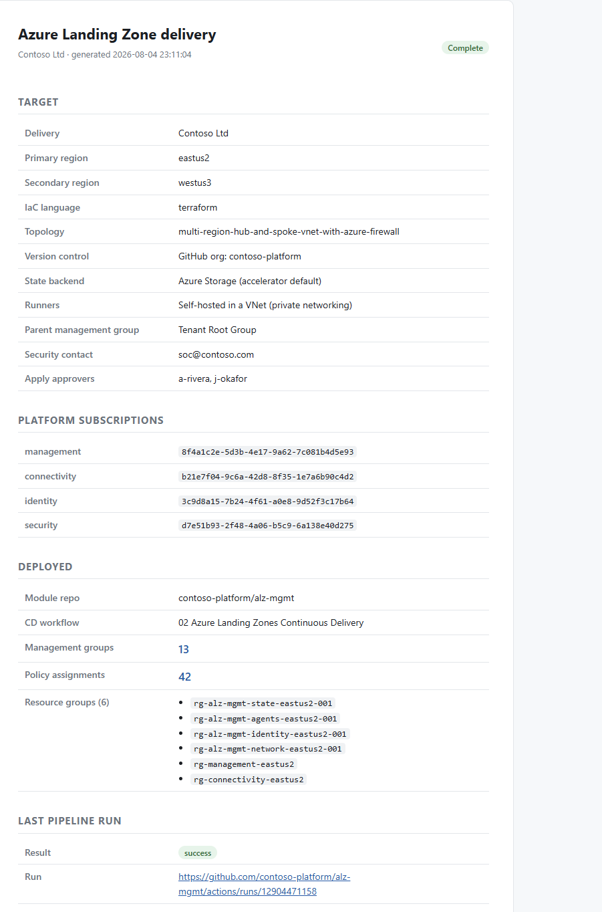
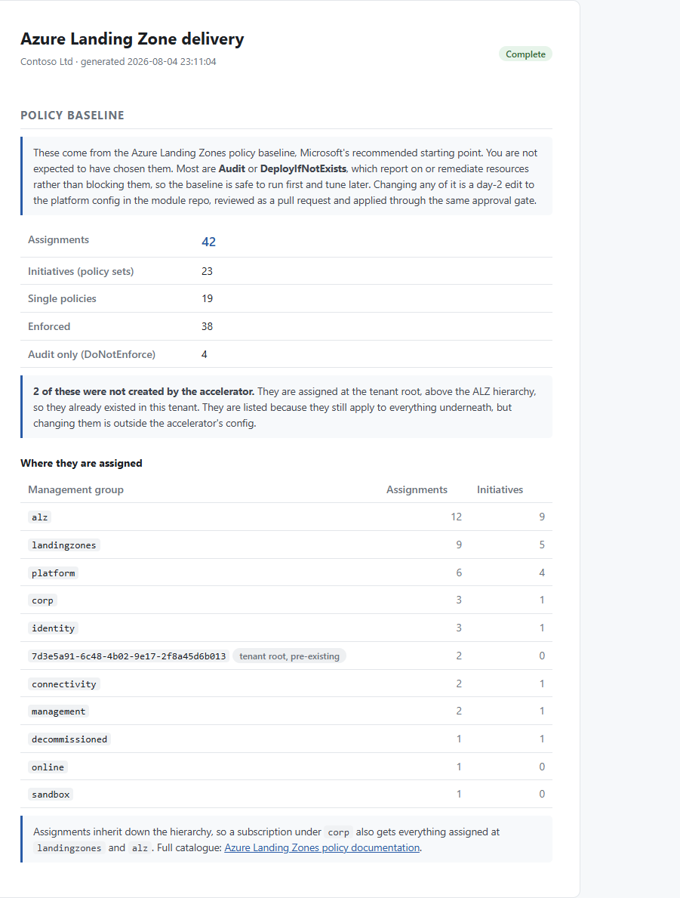
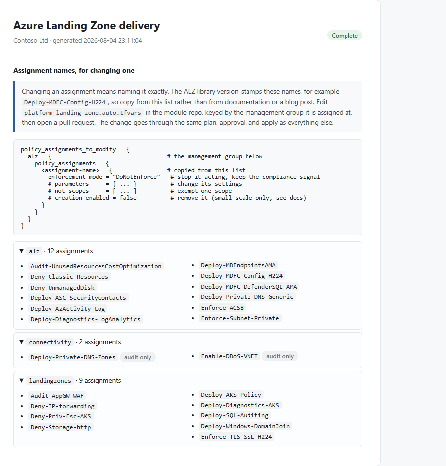

<!-- markdownlint-disable -->
<p align="center">
  
</p>

# ALZ Autopilot

[](CHANGELOG.md)
[](LICENSE)
[](https://learn.microsoft.com/powershell/)

ALZ Autopilot guides platform bootstrap through the official [Azure Landing Zones IaC Accelerator](https://azure.github.io/Azure-Landing-Zones/accelerator/) and prepares workload changes in existing GitHub repositories. It keeps configuration review, deployment approval, and state ownership explicit.

Start with the [scenario guide](HOW-TO-USE.md) for step-by-step instructions. Use this README for supported features, boundaries, and development checks.

## Choose an operation

AutoPilot is a delivery companion, not a prerequisite for operating the resulting repositories. The source code, backend binding, workflow and approval rules remain in standard GitHub and Terraform artifacts.

| Operation | Boundary |
|---|---|
| [Bootstrap a new platform](HOW-TO-USE.md#1-bootstrap-a-new-platform) | Configure delivery infrastructure and platform deployment. Do not use it to add resources to an existing workload. |
| [Attach a new workload](HOW-TO-USE.md#2-attach-a-new-workload) | Select an unused Terraform root and state key. Reuse existing repositories, runners, and state storage. |
| [Update an attached workload](HOW-TO-USE.md#3-update-an-attached-workload) | Keep the exact root, backend, and state lineage. Preserve custom manifest fields, initialization hooks, the caller workflow, access helper, and reusable template. |
| [Review module upgrades](HOW-TO-USE.md#4-review-module-upgrades) | Inspect release information and the local module cache, then follow a separate PR-based upgrade procedure. No module pins are edited. |
| [Review a migration or import](HOW-TO-USE.md#5-review-a-migration-or-import) | Review ownership, backups, and the migration procedure. No imports, state commands, or bootstrap are executed. |

A new Azure resource can be an ordinary update to an existing Terraform root. It does not automatically need a new state or bootstrap. Existing platform changes still go through the platform repository's reviewed pipeline; do not create a second platform delivery to make an update.

## Official release checks

Before operation selection, AutoPilot checks the official ALZ PowerShell package, bootstrap modules and Terraform/Bicep starter releases. These unauthenticated metadata requests have bounded timeouts. An unavailable feed is reported as unknown, not as current or as a deployment blocker. Use `-SkipUpdateCheck` for offline operation. No package, module, lock file or state is upgraded by the check.

| Version layer | How to handle changes |
|---|---|
| ALZ PowerShell package | Tool used for bootstrap. Keep installed versions; if missing, explicitly approve an exact stable version to install. |
| Bootstrap and starter packages | Delivery-generation components. Cached versions are not proof of deployed module versions. Review their release notes separately. |
| ALZ Terraform modules | Inspect the selected repository's module source/version pins and upstream upgrade notes. Upgrade in a dedicated PR, not while adding an unrelated workload. |
| Terraform providers and CLI | Review source constraints, workflow CLI version and provider lock together. The provider lock does not lock Terraform module versions. |

For an existing deployment, preserve the backend and resource addresses, change a small dependency set on a feature branch, run validation and a fresh plan, review policy changes/replacements, test, then approve deployment. A new starter release is not a reason to rerun bootstrap. Incomplete pinned bootstrap downloads now stop for recovery without deleting delivery folders or Terraform state.

## Workload updates without another bootstrap

Choose **Attach a new workload** or **Update an attached workload** to use an already bootstrapped private GitHub repository. These paths do not run the accelerator, create delivery infrastructure or replace ALZ root files. Legacy saved workload interviews retain their existing operation selection.

- Select the exact repository, Terraform root, deployment subscription and existing storage backend. A new workload requires an unused folder and state key. An update requires its original state and verified lineage.
- Use local read-only discovery, or defer private-state validation to an existing self-hosted runner. A failed or deferred read is never classified as an empty environment.
- Opt into draft PRs for a new workload and its existing templates repo. Review and merge any necessary templates PR first. Ordinary attached-workload updates preserve both caller and reusable workflow; workflow upgrades need their own PR. The official reusable workflow path and OIDC contract stay unchanged.
- PRs and pushes plan only. Apply is a separate default-branch dispatch that names the reviewed plan run and confirms the target subscription. The saved plan must match the commit, manifest and backend. Deletions, replacements, imports and management-group changes are blocked; these need a separate migration procedure.
- Existing environment protection rules remain in force. Explicit dispatch is intentional execution, not independent approval. GitHub Team does not support required deployment reviewers for private repositories. Sensitive plan artifacts are private and retained for one day.

Updates inspect the existing manifest and caller at the discovered commit. They retain unknown manifest fields and operator hooks. A missing manifest, changed backend/root, mismatched lineage or unsupported caller contract stops for manual onboarding or migration review. The app does not regenerate a bespoke workflow to make it fit. A runner-based update needs an expected lineage from a prior successful run; the private runner must verify it before planning.

### Security review profiles

Pipeline onboarding defaults to `production`. The read-only preflight checks private visibility, organization 2FA/base permissions, public-repository creation, required reviews/checks and history protection for both workload and templates repositories, workflow-token defaults, and the actual apply environment's exact branch and reviewer rules. Unknown or denied evidence is not a pass. Classic branch-protection APIs are inspected; equivalent rulesets need a separate review if those APIs do not describe the enforced configuration.

The explicit `learning` profile reports these gaps as warnings, except that workload repositories must still be private and basic runner/identity access must work. It does not manufacture an approval gate or change organization settings. Security snapshots are point-in-time evidence, not enforcement against future drift; GitHub and Azure must enforce the real boundaries.

### Runner boundaries

New callers select plan and apply runners separately, with default labels `self-hosted,Linux,X64,alz-plan` and `self-hosted,Linux,X64,alz-apply`. Preflight enumerates all visible runners, requires online matches and rejects overlapping runner IDs in production. The environments must also use different Azure client IDs. Existing callers without stage-specific labels retain their legacy routing and are assessed as configured; an ordinary update does not rewrite them.

Labels are not a security sandbox. Production requires a separate platform-owner review of clean disposable hosts, runner-group/workflow restrictions, network isolation and no shared privileged host identity. `runnerIsolationReviewed` records that acknowledgment; it is not automatic attestation. AutoPilot does not create, re-register, relabel or destroy runners. Provision that boundary through a separately reviewed platform change before selecting production mode.

### Scoped access setup

The generated [Initialize-WorkloadAccess.ps1](data/Initialize-WorkloadAccess.ps1) is read-only unless explicitly run with `-Apply` and confirmed. Its defaults are Reader for planning on approved subscriptions, Contributor for applying in the named existing resource groups, and container-scoped backend access for state and locking. RBAC Administrator is no longer an automatic grant. Broader existing access is not automatically revoked.

For explicit exceptions, review `access.applyRoles` entries in the workload manifest. Each entry contains `role` and an exact `scope` within an approved subscription. Role-assignment administration must be explicitly listed at the smallest required scope. Owner and management-group grants are rejected. Subscription-level apply entries additionally require `-AllowSubscriptionScope`; it is not a substitute for manifest review. All identity, scope and OIDC checks finish before approved writes begin, and conditional grants are never silently replaced with unconditional grants.

Resource-group permissions cannot create a resource group that does not exist. A new-state workflow that creates its groups therefore needs separately approved, explicit subscription-level permissions, or a separately reviewed onboarding design for pre-created groups. The app does not classify an existing group as greenfield to bypass this boundary. Resource-provider registration, imports, policy exceptions and privilege elevation are not automatic.

Workload automation currently supports private GitHub repositories, existing Linux x64 self-hosted runners, and Azure Storage with the default Terraform workspace. Backend and deployment subscriptions can differ. Budget alerts do not stop Azure consumption; review total projected cost before approving an apply.

## Platform delivery phases

These phases apply to platform bootstrap. Workload attachment and review-only operations follow the separate procedures in the scenario guide.

| Phase | What happens |
|---|---|
| **Plan** | A short interview for the few real decisions; answers saved after every step |
| **Prerequisites** | Check connectivity, tooling, Azure access, resource providers, version control access, and HCP Terraform when selected. |
| **Configuration** | Generate bootstrap inputs and the selected platform configuration for review. |
| **Bootstrap** | Runs `Deploy-Accelerator`, verifies GitHub workflows, and translates known errors. Azure DevOps repository verification remains manual |
| **Deploy** | Triggers + watches the `02 Continuous Delivery` pipeline, or prints a step-by-step manual runbook |

## What it supports

| | |
|---|---|
| **IaC** | Terraform; Bicep integration is preview in this wrapper |
| **Terraform topologies** | All 11 accelerator scenarios: management-only, single/multi region, hub-and-spoke or Virtual WAN, Azure Firewall or NVA, plus the two SMB scenarios |
| **Platform networking** | Per-region VPN and ExpressRoute gateway choices, DDoS Network Protection, Azure Firewall/NVA selection, firewall SKU, and supported NAT gateway attachment |
| **Bicep topologies** | Config generation for `none`, `hubNetworking`, and `vwanConnectivity`. End-to-end deployment is not validated here; the additional networking questions are Terraform-only |
| **State** | Azure Storage (accelerator default) or HCP Terraform, with the HCP migration verified |
| **Runners** | GitHub-hosted, or self-hosted in a VNet with private networking |
| **Regions** | Single and multi-region (a second region is collected when the scenario needs one) |
| **Customization** | Select an existing `lib` folder in the interview, or use the automatically detected `config/lib`. The selection is shown and rechecked at the review gate. See [samples/lib-pci](samples/lib-pci/README.md) |
| **Version control** | GitHub end to end. Azure DevOps through config generation and bootstrap, then a printed runbook for stage 2. Local file system is not supported |

The platform config is generated from the **official** scenario file for your choice, then it is yours to edit. Re-runs patch only the values the interview owns (regions, security contact, subscription placement) so hand edits survive.

If networking answers change, the app asks before regenerating an existing Terraform config. The default is **No**: preserve the file and reconcile the new choices manually during review.

### Platform networking choices

| Choice | Generated configuration and limits |
|---|---|
| VPN | Create or omit the VPN gateway in each selected region. Configure VPN sites, connections, BGP, and routing separately |
| ExpressRoute | Create or omit the ExpressRoute gateway in each region. A circuit, peering, and gateway connection are not supplied by this question |
| DDoS | Create or omit the Network Protection plan. Omitting it also disables the scenario's `Enable-DDoS-VNET` assignments at `connectivity` and `landingzones` |
| Azure Firewall or NVA | Select the corresponding full-size scenario. NVA appliance deployment, licensing, next-hop addresses, and routing remain manual; SMB scenarios retain their Azure Firewall design |
| Firewall SKU | Choose Basic, Standard, or Premium and review the resulting design and feature limits |
| NAT gateway | Optional attachment to `AzureFirewallSubnet` in hub-and-spoke scenarios with Azure Firewall Standard or Premium. Choose StandardV2 or Standard; the generated public IP uses the matching SKU. Virtual WAN hub and NVA subnet NAT are not generated |

Management-only skips these questions. Existing network resources, custom CIDRs, gateway SKUs, scale units, and connection details still require review in the platform config. The published scenario cost estimates are baseline figures, not a price quote for your selected options. Check [NAT gateway integration with Azure Firewall](https://learn.microsoft.com/azure/nat-gateway/tutorial-hub-spoke-nat-firewall) and regional SKU availability before deployment.

## Safety gates

The app separates discovery, proposal publication, bootstrap, and deployment. These platform prompts do not replace GitHub approval rules or Azure permissions. Verify the actual controls before each delivery.

| Gate | When | Default |
|---|---|---|
| **Confirm target state** | After the interview, before anything runs. Shows tenant, subscriptions by name, topology, regions, runners, and estimated cost | Prompts |
| **Register resource providers** | Separate opt-in during preflight. This is an Azure write, before the configuration review gate | Prompts; answer No for a read-only rehearsal |
| **Review configuration** | After config generation, before bootstrap. Offers to open the file, because after bootstrap it lives in the repo and changes go through a pull request | **Stops unless you confirm** |
| **Run the bootstrap** | Before any Azure resource or repo is created | Prompts |
| **Trigger the pipeline** | Manual dispatch of the CD workflow. Runs `terraform plan` first | Prompts |
| **Apply approval** | The accelerator's GitHub environment gate, when supported by the repository's plan and actually configured | Verify the real rules; manual dispatch alone is not independent review |

When a supported environment gate exists, GitHub enforces it server-side. The tool detects pending approval and waits. It only submits an approval on your behalf after an explicit opt-in that defaults to No, and GitHub must authorize your account. The presence of an environment does not prove reviewers, self-review prevention or bypass restrictions are configured.

The accelerator's documented requirement to review the platform configuration before deploying is respected. The tool fills in the values that are usually hand-edited (regions, security contact, subscription placement) so the classic placeholder mistakes cannot happen, and then still stops and asks you to review the file before the bootstrap.

## What it fixes

| Pain in the raw accelerator | What this adds |
|---|---|
| Steps spread across a wizard, two web UIs, and several doc pages | One `Start-ALZDelivery.ps1` entry point |
| Errors surface as Terraform stack traces mid-apply | Preflight validates tooling, Azure Owner, resource providers, GitHub PAT/org/Members, and HCP **before** bootstrap |
| Pointing a greenfield tool at a tenant that is already in use | Preflight detects an existing hierarchy, subscriptions parented elsewhere, and subscriptions that already contain resources |
| An interrupted session loses delivery context | Saved answers and phase status support a reviewed resume. |
| Manual bootstrap inputs are inconsistent | Generate inputs from the interview and preserve the starter template tokens. |
| Cryptic failures (RP timeout, SSO, backend-config, TF_TOKEN, missing Workflows/Members scope) | Known failures matched to plain-language remediation |
| An unformatted config fails `terraform fmt -check` in CI, blocking every future pull request | The generated config is fmt-checked and corrected before the bootstrap |
| "Bootstrap succeeded" but the repos are empty | Post-bootstrap check verifies the repos actually received the workflows |
| PAT pasted into notes/files | Token entered masked, used in-memory only, never written to disk |
| Manual pipeline click-through + guessing the approval gate | Discovers the repo, triggers + watches the run, detects the apply gate, verifies MGs + policies |
| "Have you done the HCP migration?" answered on trust | Eight live checks against the repos: cloud block, no leftover azurerm backend, `TF_TOKEN_app_terraform_io` secret, no `-backend-config` flags, secret wiring, `secrets: inherit` |

## GitHub plan note

The accelerator uses GitHub **environments** for Azure authentication and deployment controls. GitHub Team supports environments, secrets and deployment-branch restrictions in private repositories, but **required deployment reviewers for private repositories require Enterprise**. Enterprise availability does not prove the gate is enabled: inspect the actual environment rules. Secret Protection and Code Security are separate products, not automatically included with an Enterprise upgrade.

Free organizations may receive public accelerator repositories. Do not assume generated configuration is safe to publish. Workload attachment requires private repositories; a public bootstrap rehearsal must contain no sensitive configuration, state, plans or credentials. See [GitHub environment feature availability](https://docs.github.com/en/actions/reference/deployments-and-environments) and the [official accelerator components](https://azure.github.io/Azure-Landing-Zones/accelerator/).

### Public repos and self-hosted runners

If you take the free org **and** enable self-hosted runners for private networking, the runners execute inside your VNet with private-endpoint access to the Terraform state, on a repo anyone can fork. GitHub advises against that pairing:

> We recommend that you only use self-hosted runners with private repositories. This is because forks of your public repository can potentially run dangerous code on your self-hosted runner machine by creating a pull request that executes the code in a workflow.

Preflight warns when it detects both. External-contributor approval and private repository visibility do not provide runner isolation. Do not execute untrusted PR code on persistent machines with deployment credentials or sensitive network access; use clean, separately governed execution pools.

### Moving to private repos later

Repos start public on a free org. To convert them afterwards:

1. Confirm that your GitHub plan supports the required private-repository controls. Team supports private environments; independent environment reviewers require Enterprise. Free private repositories do not provide the environment controls this workflow depends on.
2. Change the module repository to private. Review collaborators, token access, and dependent workflows.
3. Change the templates repository to private.
4. In the templates repository, open **Settings > Actions > General > Access** and allow access from the intended organization repositories. Verify that the caller can resolve the private reusable workflow.
5. **Verify without deploying**: confirm visibility, reusable-workflow access, OIDC configuration and plan execution. Inspect which approval rules your plan supports and what is actually configured. Only approve an apply after a separate plan review.

Keep workload and shared workflow repositories private unless their contents and publication risks have been reviewed. A templates repository is part of the deployment trust boundary, not inherently safe to publish.

## Requirements

The following permissions describe platform bootstrap. Workload attachment reuses existing delivery resources and follows the [operation-specific prerequisites](HOW-TO-USE.md#check-access-for-the-selected-operation).

- PowerShell 7.4+
- Azure CLI 2.55+ signed in (`az login`)
- A GitHub **organization** and a fine-grained PAT with repo permissions (Actions, Administration, Contents, Environments, Secrets, Variables, **Workflows**) all Read/write, plus Organization **Members** Read/write (see the accelerator [GitHub prerequisites](https://azure.github.io/Azure-Landing-Zones/accelerator/1_prerequisites/github/))
- A second PAT (Repository Administration + Organization Self-hosted runners) if you choose self-hosted runners
- Optional: an HCP Terraform workspace in **Local** execution mode (if using HCP for state)
- Bicep only: **User Access Administrator** at the root (`/`) scope, which Terraform does not need

## Usage

```powershell
.\Start-ALZDelivery.ps1 -DeliveryPath "$HOME\Documents\ALZ-Platform" -NoClear
```

Run the command from the ALZ Autopilot repository. The delivery folder's parent must exist and must not be cloud-synced.

- `-DeliveryPath` - root folder for this delivery's `config/`, `output/`, and saved state. If omitted, you're prompted. Use a plain local path, not a cloud-synced folder.
- `-Reset` - ignore saved app answers. This does not reset or recover Terraform state. Do not use it to recover an interrupted deployment.
- `-SkipPreflight` - jump to config/bootstrap (not recommended).
- `-NoClear` - keep existing console output instead of clearing the screen on start.
- `-SkipUpdateCheck` - skip online official-release metadata lookups; keep installed versions and local version records unchanged.
- `-ConnectivityOnly` - probe all supported public services, then exit without creating delivery files or requiring Azure sign-in.
- `-ConnectivityTimeoutSeconds` - connection/read timeout for each HTTPS probe, from 1 to 60 seconds; default 10.

Reusing the delivery folder offers to resume its saved operation. Review what completed and what changed before approving another action.

### Connectivity and proxies

```powershell
.\Start-ALZDelivery.ps1 -ConnectivityOnly
```

This checks Entra sign-in, Azure Resource Manager, Microsoft Graph, PowerShell Gallery and its download CDN, GitHub source/API/archive/release endpoints, Terraform downloads and registry, Azure DevOps, HCP Terraform, and Bicep release metadata. The bootstrap release probe uses a pinned v7.2.1 sample; it does not select the version that will be installed. Normal preflight selects the applicable services and stops on a failed check before installing the ALZ module or running bootstrap.

The checks distinguish proxy authentication, TLS/certificate failures, DNS errors, timeouts, unexpected response types, and rejected HTTP requests. Proxy values, response bodies, and raw exception messages are not printed. No certificate checks are disabled and no proxy settings are changed.

The accelerator [does not explicitly support corporate proxies](https://azure.github.io/Azure-Landing-Zones/accelerator/1_prerequisites/). Passing these unauthenticated PowerShell probes is not proof that Git, Azure CLI, Terraform, full downloads, private storage, or deployed runners will work. Those processes can use different proxy settings and certificate stores. Work with the network team or use an approved execution environment; the upstream guidance suggests a temporary Azure VM when a corporate proxy blocks the local machine.

## Flow

```
Plan (interview) -> Prerequisites -> Generate config -> Bootstrap -> [HCP state] -> Deploy platform -> Report
```

Plan, Prerequisites, Generate config, and Bootstrap are guided by the CLI. GitHub platform deployment can be driven from the CLI or handed off as a manual runbook. Azure DevOps uses the manual handoff. The GitHub guided path checks HCP migration readiness against the repos when HCP is selected. Both the guided closing step and the manual handoff write a report; early prerequisite failures and stops before bootstrap do not.

## Layout

```
ALZAutoPilot/
  Start-ALZDelivery.ps1     # entry point / orchestrator
  modules/
    ALZUI.psm1              # console output, progress, summary, remediation panels
    ALZState.psm1           # state persistence + resume (never stores secrets)
    ALZSecurity.psm1        # secret handling and input sanitization
    ALZPreflight.psm1       # all prerequisite checks + RP registration
    ALZConfig.psm1          # interview + config generation
    ALZOrchestrator.psm1    # Deploy-Accelerator wrapper + error translation
    ALZPipeline.psm1        # pipeline trigger/watch/verify + HCP readiness checks
    ALZReport.psm1          # HTML delivery report
    ALZWorkload.psm1        # workload attachment, preserved updates, and review-only operations
  data/
    providers.json          # ALZ-recommended resource providers
    scenarios.json          # Terraform scenario catalog
    traps.json              # known error signatures -> remediation
    scenarios/              # the 11 official Terraform scenario configs
    scenarios-bicep/        # the official Bicep platform config
  samples/
    lib-pci/                # custom library example: regulated MG + PCI/HIPAA
  tests/
    Test-ALZConfigConformance.ps1   # offline: generated config vs the accelerator schema
    ALZAutopilot.Tests.ps1         # mocked reports, networking, library, and connectivity tests
  .github/workflows/
    validate.yml                  # Windows/Linux tests and schema validation; no Azure credentials
  CHANGELOG.md              # version history
  .alz-delivery-state.json  # created per delivery folder (not here)
```

## Delivery report

The guided closing step and manual handoff write `<delivery>\reports\alz-delivery-<timestamp>.html`. The console keeps a short summary and points at it. Manual GitHub and Azure DevOps handoffs retain a pending deployment state and show the observed Azure inventory; existing resources do not prove this delivery succeeded. A report is still written if inventory lookup is unavailable.

One self-contained file with inline CSS and no external references: it opens offline, emails cleanly, and prints for a closeout deck. It contains no credentials, and every value is HTML-encoded.

<p align="center">
  
</p>

What is in it:

| Section | Contents |
|---|---|
| Target | Region, topology, version control, state backend, runners, approvers |
| Platform subscriptions | Each role, or "not supplied" where you skipped one |
| Deployed | Module repo, management group and policy counts, resource groups |
| Policy baseline | What the baseline is, counts by type and enforcement, per management group, and the exact assignment names |
| Phases | Status and duration for each phase |
| Session | Run counts, delivery age, folder |

### The policy baseline section

This exists because the most common question after a first deployment is "what did I just deploy, and how would I know what is normal?" It answers that from your tenant rather than from documentation:

- Totals: assignments, initiatives, single policies, enforced vs audit-only.
- A per management group breakdown, with a reminder that assignments inherit downward.
- **The exact assignment names**, collapsed per management group. The ALZ library version-stamps these (`Deploy-MDFC-Config-H224`), so they cannot be guessed or copied from a blog post. A snippet above them shows where the name goes in `policy_assignments_to_modify`.
- Assignments at the tenant root are labelled **pre-existing**, because the accelerator only assigns at `alz` and below. Without that, policies that were already in the tenant get misread as something the accelerator deployed.

<p align="center">
  
</p>

<p align="center">
  
</p>

Before the pipeline has run there are no assignments yet, so the section says so and tells you to re-run afterwards rather than showing a bare zero.

Screenshots above are rendered from fictional data by `scripts/New-SampleReport.ps1`.

## Tests

```powershell
.\tests\Test-ALZConfigConformance.ps1
```

Parses `variables.tf` from the accelerator's own bootstrap modules and checks the generated `inputs.yaml` against it, across GitHub and Azure DevOps, Terraform and Bicep: every key emitted is one the module declares, every required variable is present, and the token is a placeholder rather than a credential. It runs entirely offline, with no Azure, GitHub, or Azure DevOps access.

If the accelerator changes its schema in a new version, this fails locally instead of failing partway through someone's bootstrap. It skips cleanly when no bootstrap module has been downloaded yet.

## Customizing for your selections

Two files come out of the config phase, both in `<delivery>\config`:

| File | What it is | Who owns it after bootstrap |
|---|---|---|
| `inputs.yaml` | Bootstrap inputs: org, subscriptions, approvers, runners, state | You, in the delivery folder. Only re-read on a re-bootstrap |
| `platform-landing-zone.tfvars` (or `.yaml` for Bicep) | Your landing zone as configuration | Pushed into the **module repo**. After that, changes go through a pull request |

Values that are normally hand-edited are filled in for you. On a re-run only regions, security contact, and subscription placement are patched, so your own edits survive.

| Your choice | What you customize, and where |
|---|---|
| **Terraform** | IP ranges, naming, DDoS, policy settings: edit the tfvars before bootstrap, or through a PR afterward |
| **Bicep** | `platform-landing-zone.yaml`, plus the generated Bicep in the module repo. Also requires User Access Administrator at the root (`/`) scope |
| **GitHub** | Branch protection, environment reviewers, and repo settings in the GitHub UI |
| **Azure DevOps** | Approvals and checks on the Apply environment, and the service connection, in the Azure DevOps UI |
| **Scenario or network type** | Treat a topology change as an architecture review. Compare configurations, dependencies, resource addresses, and replacement risks before preparing a migration or deployment PR. |
| **Multi-region** | Extend `starter_locations`. A real multi-entry list is never shrunk on a re-run |
| **HCP Terraform** | The `cloud {}` block, the `TF_TOKEN_app_terraform_io` secret, removing `-backend-config` flags, and `secrets: inherit`. Eight live checks tell you which is still wrong |
| **Self-hosted runners** | Needs a second PAT at bootstrap. Address space and subnet prefixes are bootstrap module variables if the defaults collide |
| **Custom library** | Put custom management groups, archetypes, and policy assignments in `<delivery>\config\lib`. See [samples/lib-pci](samples/lib-pci/README.md) |

If you pick a different Terraform scenario on a re-run, the tool notices the existing platform config no longer matches and asks before replacing it, because replacing discards manual edits.

## Security

- **Prompted credentials:** Tokens are entered through hidden prompts and used in memory or process-scoped environment variables. AutoPilot does not intentionally write them into its answer file or bootstrap inputs.
- **Credential cleanup:** Bootstrap token variables are cleared in a `finally` block. The conversion helper releases its unmanaged buffer, and the app removes known token values from its transcript. These measures do not guarantee that every external tool redacts every sensitive value.
- **Sensitive artifacts:** Terraform state, plans, logs, and backups can contain credentials or customer data. Restrict access, keep them out of Git, and review retention. A private repository is not a secret store.
- **Input handling:** The app validates supported interview values, serializes structured configuration, and encodes supported API path values. Review custom scripts, templates, and workflow changes before execution.
- **Transport:** GitHub and HCP API calls use HTTPS with certificate validation. Do not disable validation to bypass connectivity failures.
- **Dependencies:** Bootstrap can download official packages and modules. Review their versions and provenance; the startup version notice does not install an update or certify the dependency chain.
- **Enforcement:** GitHub and Azure enforce repository access, approval, identity, and policy controls. AutoPilot reports observed settings and prepares proposals; its local security profile is not an authorization boundary.

## Known limitations

| Limitation | Detail |
|---|---|
| **Existing environments** | Platform discovery reports existing hierarchy, subscription placement, and resources. Adoption and policy rollout require a separate design and state-ownership review. Workload guards do not import resources or migrate state. See [Brownfield tenants](HOW-TO-USE.md#brownfield-tenants). |
| **Azure DevOps stage 2** | Config generation and bootstrap are automated. Triggering and watching the pipeline is GitHub-only |
| **Bicep integration** | Preview in Autopilot. Config generation and bootstrap delegation are implemented, but end-to-end deployment, Bicep-specific validation, and the extra networking questions are not validated or implemented to Terraform parity |
| **Corporate proxies** | Diagnostic checks are available; upstream proxy support, per-tool authentication/trust, and runner network access are not guaranteed |
| **Local file system VCS** | Not supported. Use the accelerator directly |
| **`bicep-classic`** | Not exposed. Terraform and Bicep only |

## Development checks

The `Validate` workflow runs Pester 5.7.1, PowerShell parser/analyzer error checks, generated Terraform formatting checks, and mandatory schema conformance on Windows and Linux. It downloads the public bootstrap v7.2.1 schema and uses no Azure credentials. Tests mock remote operations; schema validation does not run bootstrap or Terraform apply.

```powershell
Import-Module Pester -RequiredVersion 5.7.1
Invoke-Pester ./tests -Output Detailed
.\tests\Test-ALZConfigConformance.ps1 -ModulesRoot "<extracted-bootstrap>\alz" -RequireSchema
```

The conformance script can skip missing schemas for an ordinary local run; `-RequireSchema` makes missing GitHub or Azure DevOps schemas fail, as they do in CI.

## Scope and roadmap

- **Tier 1 (this)**: orchestration, preflight, config generation, resume, error translation.
- **Tier 2**: live status dashboard and automated remediation for matched errors.
- **Tier 3**: a conversational ALZ delivery agent (interview + narrate) reusable across engagements.

## Sources

Platform bootstrap delegates to the official accelerator. The workload attachment, security preflight, and review-only flows are AutoPilot features. The following table identifies the sources used for platform configuration and guidance:

| What | Where it comes from |
|---|---|
| Platform config files | The accelerator's own scenario examples, bundled unmodified |
| Scenario names and numbers | [Scenarios](https://azure.github.io/Azure-Landing-Zones/accelerator/starter-terraform/scenarios/) |
| Cost estimates | The same page's published table (westus, USD, fixed infrastructure only). For another region or currency use the accelerator's `Get-ScenarioCostEstimates.ps1` |
| Management group hierarchy shown at confirmation | The official `alz` architecture definition in the [ALZ Library](https://github.com/Azure/Azure-Landing-Zones-Library) |
| Resource provider list | [Resource providers FAQ](https://azure.github.io/Azure-Landing-Zones/faq/resource-providers/) |
| PAT scopes and prerequisites | [GitHub prerequisites](https://azure.github.io/Azure-Landing-Zones/accelerator/1_prerequisites/github/) and [Platform subscriptions](https://azure.github.io/Azure-Landing-Zones/accelerator/1_prerequisites/platform-subscriptions/) |
| Error remediation | Entries carrying a doc link restate official guidance. Entries without one are failures seen in live deliveries that the official troubleshooting page does not yet cover |

If the accelerator changes, treat the upstream documentation as the source of truth and refresh the bundled files (see [data/README.md](data/README.md)).

## License and attribution

MIT. See [LICENSE](LICENSE).

The platform configuration files under `data/scenarios/` and `data/scenarios-bicep/` are **unmodified** copies from Microsoft's [alz-terraform-accelerator](https://github.com/Azure/alz-terraform-accelerator) and [alz-bicep-accelerator](https://github.com/Azure/alz-bicep-accelerator), both MIT licensed. They are bundled so a delivery works offline against a known-good version. Attribution and the upstream license are in [NOTICE](NOTICE); for current versions always refer to the upstream repositories.

This is a personal project. It is not produced, endorsed, or supported by Microsoft.

## References

- [Accelerator overview](https://azure.github.io/Azure-Landing-Zones/accelerator/)
- [Phase 1 - Prerequisites](https://azure.github.io/Azure-Landing-Zones/accelerator/1_prerequisites/)
- [Resource provider recommendations](https://azure.github.io/Azure-Landing-Zones/faq/resource-providers/)
- [Starter Terraform scenarios (cost table)](https://azure.github.io/Azure-Landing-Zones/accelerator/starter-terraform/scenarios/)
